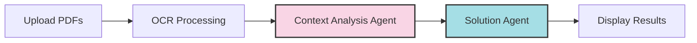

# 📘 JEE Advanced Solver Pro

<div align="center">
  
  
  
  
  
  
  _A multi-agent AI system for solving JEE Advanced problems with context-aware reasoning_
</div>

## 🚀 Overview
JEE Advanced Solver Pro is an AI-powered application that helps students solve Joint Entrance Examination (JEE) Advanced problems with step-by-step solutions. The app leverages advanced OCR technology and multiple AI models in a multi-agent setup to extract, analyze, and solve complex JEE problems with precision.

<div align="center">
  
  ```
  Upload PDF → Extract Text → Analyze Context → Generate Solutions
  ```
</div>

## 🌟 Key Features
- 📄 **PDF Text Extraction**: Uses Mistral OCR to accurately extract text from PDFs, preserving mathematical notation
- 📚 **Contextual Problem Solving**: Allows users to upload study materials that the AI references when solving problems
- 🧮 **Step-by-Step Solutions**: Generates detailed, step-by-step solutions with clear mathematical reasoning
- 🔍 **Context Relevance Analysis**: Identifies and explains connections between your study materials and JEE problems
- 🤖 **Multi-Agent AI System**: Utilizes LangGraph to orchestrate a workflow of specialized AI agents for better results

## 🏗️ Technical Architecture

### Core Components
1. **Streamlit UI** 🖥️: User-friendly interface with file uploaders, API key inputs, and structured output display
2. **OCR Processing (Mistral)** 👁️: Advanced OCR capabilities for extracting text from PDFs with mathematical content
3. **LLM Integration (Google Gemini)** 🧠: Leverages Gemini 2.0 Flash for question analysis and solution generation
4. **Multi-Agent Workflow (LangGraph)** ⚙️: Orchestrates multiple AI agents in a directed workflow

### Agent Workflow


1. **Context Analysis Agent** 📊: Analyzes study materials to identify relevant content for each question
2. **Solution Agent** 🧩: Solves JEE Advanced questions using both context information and AI knowledge

## 📦 Dependencies
<div align="center">
  
| Package | Purpose |
|---------|---------|
| streamlit | User interface |
| google.generativeai | LLM capabilities |
| langgraph | Multi-agent orchestration |
| mistralai | OCR processing |
| asyncio | Asynchronous operations |
| python-dotenv | Environment management |
</div>

## ⚡ How It Works

### Data Flow
1. User uploads question PDF (required) and context PDF (optional)
2. PDFs are processed using Mistral OCR to extract text
3. If context is provided, the Context Analysis Agent identifies relevant information
4. The Solution Agent generates comprehensive solutions with explanations
5. Results are displayed in a structured format with downloadable solutions

### AI Prompt Engineering
The application uses carefully engineered prompts to:
- 🎯 Extract core topics from questions
- 🔎 Find relevant information in context materials
- 📝 Generate precise step-by-step solutions
- 🔣 Ensure clear mathematical notation in outputs
- 🔄 Explain connections between context materials and solutions

## 🎓 Use Cases
- **JEE Advanced Exam Preparation** 📚: Students can practice with past papers and get detailed solutions
- **Concept Understanding** 💡: By uploading study materials, students can see how concepts apply to specific problems
- **Teaching Aid** 👨‍🏫: Educators can use the tool to generate comprehensive solution guides for students

## 💼 Best Practices
- 📊 Upload high-quality, readable PDFs
- 📑 For context PDFs, include textbooks, study notes, or solved examples related to the questions
- 📈 More comprehensive context materials yield better results
- 🔄 The system considers multiple types of relevance between context and questions:
  - ✓ Direct examples and solved problems
  - ✓ Related concepts that can be adapted
  - ✓ Formulas and principles that apply to the question
  - ✓ Problem-solving techniques and methodologies

## 🛠️ Installation & Setup

```bash
# Clone the repository
git clone https://github.com/yourusername/jee-advanced-solver-pro.git

# Navigate to the project directory
cd jee-advanced-solver-pro

# Install dependencies
pip install -r requirements.txt

# Run the application
streamlit run "JEE Advanced Solver Pro.py"
```

### API Keys Required:
- 🔑 Google Gemini API key for LLM capabilities
- 🔑 Mistral API key for OCR functionality

## 📋 Usage Instructions
1. Enter your API keys for Google Gemini and Mistral
2. Upload a Questions PDF containing JEE Advanced problems
3. Optionally upload a Context PDF with study materials
4. Click "Extract & Solve Questions" to process
5. View and download the generated solutions

<div align="center">
  
  
</div>

## 🔧 Advanced Features
- ⏱️ **Retry Logic**: Built-in handling for API quota limits with exponential backoff
- 🛡️ **Error Handling**: Comprehensive error detection and user feedback
- 📂 **Content Organization**: Tabbed interface for easy navigation between solutions, analysis, and extracted text
- 📊 **Progress Tracking**: Visual indicators of processing status with expandable details

## 🔬 Technical Details

### State Management
The application uses LangGraph's StateGraph to manage application state:
- 🔑 API keys
- 📄 Extracted text from PDFs
- 📊 Relevance analysis results
- 📝 Generated solutions

### Error Handling
- 📁 PDF upload failures
- 👁️ OCR extraction issues
- 🔄 API quota limitations
- ⚠️ Runtime exceptions

## 🔮 Future Enhancements
- 📚 Support for additional exam formats beyond JEE Advanced
- 🤝 Integration with more LLM providers
- 🔣 Enhanced mathematical notation rendering
- 👥 Real-time collaborative solving
- 🧩 Custom prompt templates for different subjects

---

<div align="center">
  
## 🎓 About JEE Advanced
  
The Joint Entrance Examination (JEE) Advanced is a highly competitive engineering entrance examination conducted for admission to the Indian Institutes of Technology (IITs). It is known for its challenging problems in Physics, Chemistry, and Mathematics that test conceptual understanding and application skills.

[](https://github.com/yourusername)
[](https://opensource.org/licenses/MIT)
</div> 